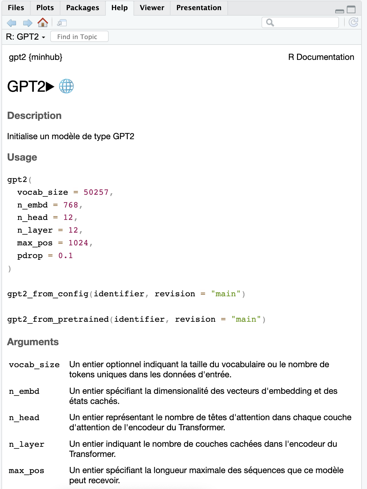

# minhub.fr

<!-- badges: start -->

<!-- badges: end -->

Le paquet d'internationalisation de **{minhub}** en français (fr)

## Installation

Vous pouvez installer la version de development de **{minhub.fr}** depuis [GitHub](https://github.com/) via:

``` r
# install.packages("pak")
pak::pak("cregouby/minhub.fr")
```

## Exemple

Voici comment utiliser {minhub} avec l'aide en français :

``` r
# configure la session en langue française
Sys.setenv(LANGUAGE = "fr")

# charge la librairie d'aide de minhub en traduction française, et {minhub}
library(minhub.fr)
library(minhub)

# consulte l'aide normalement
?gpt2
```


